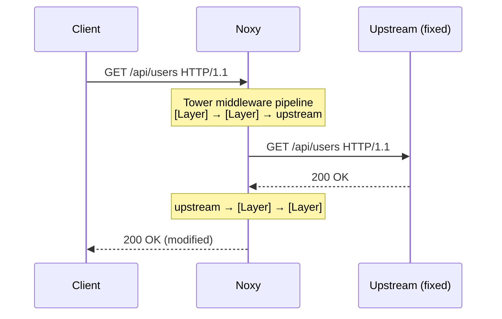
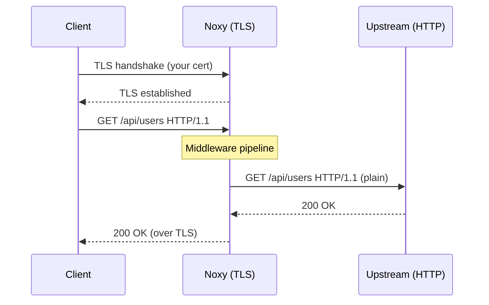

```mermaid
sequenceDiagram
    participant C as Client
    participant N as Noxy
    participant S as Server

    C->>N: CONNECT example.com:443
    N-->>C: 200 OK

    N->>S: TLS handshake (real cert verified)
    S-->>N: TLS established

    Note over N: Generate fake cert for<br/>example.com signed by CA

    C->>N: TLS handshake (fake cert)
    N-->>C: TLS established

    rect rgb(40, 40, 40)
        Note over C,S: TLS Session 1 ← Noxy → TLS Session 2

        C->>N: GET / HTTP/1.1
        Note over N: Tower middleware pipeline<br/>[Layer] → [Layer] → upstream
        N->>S: Forwarded request

        S-->>N: Response
        Note over N: upstream → [Layer] → [Layer]
        N-->>C: Modified response
    end
```

# Noxy

> *The darkness your packets pass through.*

An HTTP proxy with a pluggable middleware pipeline. Forward mode intercepts HTTPS via TLS MITM; reverse mode sits in front of a backend and forwards traffic directly. Built on top of [tower](https://crates.io/crates/tower), Noxy gives you full access to decoded HTTP requests and responses flowing through the proxy using standard tower `Service` and `Layer` abstractions -- including all existing [tower-http](https://crates.io/crates/tower-http) middleware out of the box.

## Features

- **Forward proxy** -- CONNECT tunnel with TLS MITM, per-host certificate generation signed by a user-provided CA
- **Reverse proxy** -- point Noxy at a fixed upstream and forward all incoming HTTP traffic directly -- no CONNECT, no CA, no client-side proxy configuration required
- **Tower middleware pipeline** -- plug in any tower `Layer` or `Service` to inspect and modify HTTP traffic. Works with tower-http layers (compression, tracing, CORS, etc.) and your own custom services.
- **Built-in middleware** -- traffic logging, header modification, URL rewriting, block list, latency injection, bandwidth throttling, fault injection, rate limiting, sliding window rate limiting, retry with exponential backoff, circuit breaker, fixed responses, and TypeScript scripting
- **Conditional rules** -- apply middleware only to requests matching a host or path (supports glob patterns: `*`, `**`, `?`, `[a-z]`)
- **TOML config file** -- configure the proxy and middleware rules declaratively
- **Upstream connection pooling** -- reuses TLS connections to upstream servers across client tunnels. HTTP/2 connections are multiplexed; HTTP/1.1 connections are recycled from an idle pool.
- HTTP/1.1 and HTTP/2 support (auto-negotiated via ALPN)
- Streaming bodies -- middleware can process data as it arrives without buffering
- Async I/O with Tokio and Hyper

## Library Usage

### Forward proxy (TLS MITM)

```rust,ignore
use std::time::Duration;
use noxy::Proxy;
use noxy::middleware::*;

let proxy = Proxy::builder()
    .ca_pem_files("ca-cert.pem", "ca-key.pem")?
    // Log all traffic with request/response bodies
    .http_layer(TrafficLogger::new().log_bodies(true))
    // Decode gzip/brotli/deflate/zstd response bodies
    .http_layer(ContentDecoder::new())
    // Add latency to every request
    .http_layer(LatencyInjector::fixed(Duration::from_millis(200)))
    // Limit bandwidth to 50 KB/s
    .http_layer(BandwidthThrottle::new(50 * 1024))
    // Global rate limit: 100 requests per second
    .http_layer(RateLimiter::global(100, Duration::from_secs(1)))
    // Per-host sliding window: 10 req/s per hostname
    .http_layer(SlidingWindow::per_host(10, Duration::from_secs(1)))
    // Retry 429/5xx responses up to 3 times with exponential backoff
    .http_layer(Retry::default().max_retries(3))
    // Trip circuit after 5 consecutive failures, recover in 30s
    .http_layer(CircuitBreaker::global(5, Duration::from_secs(30)))
    // Inject request/response headers
    .http_layer(
        ModifyHeaders::new()
            .set_request("x-proxy", "noxy")
            .remove_response("server"),
    )
    // Rewrite request paths
    .http_layer(UrlRewrite::path("/api/v1/{*rest}", "/v2/{rest}")?)
    // Block tracking domains
    .http_layer(BlockList::new().host("*.tracking.com")?)
    // 50% of requests to /flaky return 503
    .http_layer(FaultInjector::new().error_rate(0.5).when_path("/flaky"))
    // Glob pattern: add latency to all paths under /api/*/slow
    .http_layer(LatencyInjector::fixed(Duration::from_millis(500)).when_path_glob("/api/*/slow")?)
    // Return a fixed response for /health
    .http_layer(SetResponse::ok("ok").when_path("/health"))
    .build()?;

proxy.listen("127.0.0.1:8080").await?;
```

### Reverse proxy

```rust,ignore
use noxy::Proxy;

let proxy = Proxy::builder()
    .reverse_proxy("http://localhost:3000")?
    .http_layer(my_tower_layer)
    .build()?;

proxy.listen("127.0.0.1:8080").await?;
```

Any tower `Layer<HttpService>` works in both modes. The innermost service forwards requests to the upstream server; your layers wrap around it in an onion model and can inspect or modify requests before forwarding and responses after.

## Installation

### Pre-built binaries

Download a pre-built binary from the [latest release](https://github.com/reu/noxy/releases/latest):

| Platform      | Architecture | Download |
|---------------|--------------|----------|
| Linux         | x86_64       | [noxy-x86_64-unknown-linux-gnu.tar.gz](https://github.com/reu/noxy/releases/latest/download/noxy-x86_64-unknown-linux-gnu.tar.gz) |
| Linux         | aarch64      | [noxy-aarch64-unknown-linux-gnu.tar.gz](https://github.com/reu/noxy/releases/latest/download/noxy-aarch64-unknown-linux-gnu.tar.gz) |
| macOS         | Apple Silicon | [noxy-aarch64-apple-darwin.tar.gz](https://github.com/reu/noxy/releases/latest/download/noxy-aarch64-apple-darwin.tar.gz) |

```bash
# Example: install on Linux x86_64
curl -L https://github.com/reu/noxy/releases/latest/download/noxy-x86_64-unknown-linux-gnu.tar.gz | tar xz
sudo mv noxy /usr/local/bin/
```

### Cargo

```bash
cargo install noxy --features cli
```

## Quick Start

### Reverse proxy (simplest)

No certificates needed -- just point Noxy at a backend:

```bash
# Start noxy in front of a local service
noxy --upstream http://localhost:3000 --log

# Requests go directly to noxy, no proxy configuration needed
curl http://127.0.0.1:8080/api/users
```

### Forward proxy (TLS MITM)

#### 1. Generate a CA certificate

```bash
cargo run --features cli -- --generate
```

Or with OpenSSL:

```bash
openssl req -x509 -newkey rsa:2048 -keyout ca-key.pem -out ca-cert.pem -days 365 -nodes -subj "/CN=Noxy CA"
```

#### 2. Run the proxy

```bash
cargo run --features cli
```

#### 3. Make a request through the proxy

```bash
curl --proxy http://127.0.0.1:8080 --cacert ca-cert.pem https://example.com
```

#### Trusting the CA system-wide

Instead of passing `--cacert` every time, you can install `ca-cert.pem` into your OS or browser trust store. This lets any application use the proxy transparently.

**Important:** Only do this in development/testing environments. Remove the CA when you're done.

## CLI

The CLI provides flags for common middleware without needing a config file.

```bash
Usage: noxy [OPTIONS]

Options:
      --config <CONFIG>        Path to TOML config file
      --cert <CERT>            Path to CA certificate PEM file [default: ca-cert.pem]
      --key <KEY>              Path to CA private key PEM file [default: ca-key.pem]
      --listen <LISTEN>        Listen address [default: 127.0.0.1:8080]
      --generate               Generate a new CA cert+key pair and exit
      --upstream <URL>         Reverse proxy mode: forward all traffic to this upstream URL
      --tls-cert <PATH>        TLS cert for client-facing HTTPS (reverse proxy mode)
      --tls-key <PATH>         TLS key for client-facing HTTPS (reverse proxy mode)
      --log                    Enable traffic logging
      --log-bodies             Log request/response bodies (implies --log)
      --latency <LATENCY>      Add global latency (e.g., "200ms", "100ms..500ms")
      --bandwidth <BANDWIDTH>  Global bandwidth limit in bytes per second
      --rate-limit <RATE>              Global rate limit (e.g., "30/1s", "1500/60s"). Repeatable.
      --per-host-rate-limit <RATE>     Per-host rate limit (e.g., "10/1s"). Repeatable.
      --sliding-window <RATE>          Sliding window rate limit (e.g., "30/1s"). Repeatable.
      --per-host-sliding-window <RATE> Per-host sliding window (e.g., "10/1s"). Repeatable.
      --retry <N>                      Retry failed requests (429, 502, 503, 504) up to N times
      --circuit-breaker <SPEC>         Circuit breaker (e.g., "5/30s" = trip after 5 failures, recover in 30s)
      --rewrite-path <SPEC>                Rewrite request path (e.g., "/old/{*rest}=/new/{rest}"). Repeatable.
      --rewrite-path-regex <SPEC>        Rewrite request path via regex (e.g., "/api/v\d+/(.*)=/latest/$1"). Repeatable.
      --block-host <PATTERN>             Block hosts matching a glob pattern. Repeatable.
      --block-path <PATTERN>             Block paths matching a glob pattern. Repeatable.
      --set-request-header <HEADER>     Set a request header (e.g., "x-proxy: noxy"). Repeatable.
      --remove-request-header <NAME>   Remove a request header. Repeatable.
      --set-response-header <HEADER>   Set a response header (e.g., "x-served-by: noxy"). Repeatable.
      --remove-response-header <NAME>  Remove a response header. Repeatable.
      --pool-max-idle <N>              Max idle connections per host (default: 8, 0 to disable)
      --pool-idle-timeout <DURATION>   Idle timeout for pooled connections (e.g., "90s")
      --accept-invalid-certs           Accept invalid upstream TLS certificates
  -h, --help                   Print help

# Log all traffic
noxy --log

# Log traffic including request/response bodies
noxy --log-bodies

# Add 200ms latency to every request
noxy --latency 200ms

# Add random latency between 100ms and 500ms
noxy --latency 100ms..500ms

# Limit bandwidth to 10 KB/s
noxy --bandwidth 10240

# Rate limit: 30 requests per second
noxy --rate-limit 30/1s

# Per-host rate limit: 10 requests per second per hostname
noxy --per-host-rate-limit 10/1s

# Multi-window rate limiting
noxy --rate-limit 30/1s --rate-limit 1500/60s

# Sliding window: hard-cap 30 requests per second
noxy --sliding-window 30/1s

# Per-host sliding window: 10 requests per second per hostname
noxy --per-host-sliding-window 10/1s

# Retry failed requests up to 3 times with exponential backoff
noxy --retry 3

# Circuit breaker: trip after 5 consecutive 5xx failures, recover after 30s
noxy --circuit-breaker 5/30s

# Rewrite request paths using matchit patterns
noxy --upstream http://localhost:3000 --rewrite-path "/api/v1/{*rest}=/v2/{rest}"

# Rewrite request paths using regex
noxy --upstream http://localhost:3000 --rewrite-path-regex "/api/v\d+/(.*)=/latest/$1"

# Block requests to tracking domains
noxy --block-host "*.tracking.com" --block-host "ads.example.com"

# Block requests to admin paths
noxy --block-path "/admin/*" --block-path "/debug/**"

# Add a request header to all proxied requests
noxy --set-request-header "x-proxy: noxy"

# Remove the Server response header
noxy --remove-response-header server

# Combine multiple flags
noxy --log --latency 200ms --bandwidth 10240

# Set upstream connection pool size per host (0 to disable)
noxy --pool-max-idle 16

# Set pool idle timeout
noxy --pool-idle-timeout 120s

# Accept invalid upstream certificates (e.g. self-signed)
noxy --accept-invalid-certs

# Custom listen address and CA paths
noxy --listen 0.0.0.0:9090 --cert my-ca.pem --key my-ca-key.pem

# Reverse proxy to a local backend
noxy --upstream http://localhost:3000 --log

# Reverse proxy to an HTTPS backend with rate limiting
noxy --upstream https://api.example.com --rate-limit 100/1s

# Reverse proxy with client-facing TLS
noxy --upstream http://localhost:3000 --tls-cert server.pem --tls-key server-key.pem
```

## Config File

For conditional rules and more complex setups, use a TOML config file.

```bash
noxy --config proxy.toml
```

CLI flags override config file settings for global options (listen address, CA paths, etc.) and append additional unconditional rules.

### Reverse proxy config

```toml
listen = "127.0.0.1:8080"
upstream = "http://localhost:3000"

# Optional: serve HTTPS to clients
# [tls]
# cert = "server.pem"
# key = "server-key.pem"

[[rules]]
log = true

[[rules]]
rate_limit = { count = 100, window = "1s" }
```

### Forward proxy config

```toml
listen = "127.0.0.1:8080"

[ca]
cert = "ca-cert.pem"
key = "ca-key.pem"

# accept_invalid_upstream_certs = true
# pool_max_idle_per_host = 8
# pool_idle_timeout = "90s"

# Log all traffic
[[rules]]
log = true

# Log with request/response bodies
# [[rules]]
# log = { bodies = true }

# Add 200ms latency to API requests
[[rules]]
match = { path_prefix = "/api" }
latency = "200ms"

# Simulate slow downloads with random latency and bandwidth limit
[[rules]]
match = { path_prefix = "/downloads" }
latency = "50ms..200ms"
bandwidth = 10240

# Inject faults on a specific endpoint
[[rules]]
match = { path = "/flaky" }
fault = { error_rate = 0.5, abort_rate = 0.02 }

# Mock a health check endpoint
[[rules]]
match = { path = "/health" }
respond = { body = "ok" }

# Rate limit: 30 requests per second globally
[[rules]]
rate_limit = { count = 30, window = "1s" }

# Rate limit: 1500 requests per minute, per host, with burst of 100
[[rules]]
rate_limit = { count = 1500, window = "60s", burst = 100, per_host = true }

# Sliding window: hard-cap 10 requests per second (no burst, no smoothing)
[[rules]]
sliding_window = { count = 10, window = "1s" }

# Sliding window: per-host, 500 requests per minute
[[rules]]
sliding_window = { count = 500, window = "60s", per_host = true }

# Retry failed requests (429, 502, 503, 504) up to 3 times
[[rules]]
retry = { max_retries = 3, backoff = "1s" }

# Retry only 503s with custom statuses
[[rules]]
match = { path_prefix = "/api" }
retry = { max_retries = 5, backoff = "500ms", statuses = [503] }

# Circuit breaker: trip after 5 consecutive 5xx failures, recover after 30s
[[rules]]
circuit_breaker = { threshold = 5, recovery = "30s" }

# Per-host circuit breaker with 2 half-open probes
[[rules]]
circuit_breaker = { threshold = 3, recovery = "10s", half_open_probes = 2, per_host = true }

# Add a request header and strip a response header
[[rules]]
request_headers = { set = { "x-proxy" = "noxy" } }
response_headers = { remove = ["server"] }

# Add API version header to /api requests
[[rules]]
match = { path_prefix = "/api" }
request_headers = { set = { "x-api-version" = "2" } }

# Rewrite request paths using matchit patterns
[[rules]]
url_rewrite = { pattern = "/api/v1/{*rest}", replace = "/v2/{rest}" }

# Rewrite request paths using regex
[[rules]]
url_rewrite = { regex = "/api/v\\d+/(.*)", replace = "/latest/$1" }

# Block requests to tracking domains and admin paths
[[rules]]
block = { hosts = ["*.tracking.com", "ads.example.com"], paths = ["/admin/*"] }

# Block with custom status and body
[[rules]]
block = { hosts = ["internal.corp.com"], status = 404, body = "not found" }

# Return 503 for all paths under /fail
[[rules]]
match = { path_prefix = "/fail" }
respond = { status = 503, body = "service unavailable" }

# Glob patterns in match conditions
# Match any subdomain of example.com
[[rules]]
match = { host = "*.example.com" }
latency = "100ms"

# Match any single-segment path under /api/
[[rules]]
match = { path = "/api/*/users" }
rate_limit = { count = 10, window = "1s" }

# Match all paths recursively under /static/
[[rules]]
match = { path = "/static/**" }
response_headers = { set = { "cache-control" = "public, max-age=86400" } }
```

### Rules

Each rule has an optional `match` condition and one or more middleware configs. Rules without a `match` apply to all requests.

| Field       | Description                                              |
|-------------|----------------------------------------------------------|
| `match`     | `{ host = "*.example.com", path = "/api/*/users" }` or `{ path_prefix = "/prefix" }` — `host` and `path` support glob patterns (`*`, `**`, `?`, `[a-z]`) |
| `url_rewrite` | `{ pattern = "/old/{*rest}", replace = "/new/{rest}" }` or `{ regex = "/v\\d+/(.*)", replace = "/latest/$1" }` -- rewrite request paths |
| `block`     | `{ hosts = ["*.tracking.com"], paths = ["/admin/*"] }` -- optional `status` and `body` fields (default: 403 empty) |
| `log`       | `true` or `{ bodies = true }`                            |
| `latency`   | `"200ms"`, `"1s"`, or `"100ms..500ms"` for random range  |
| `bandwidth` | Bytes per second throughput limit                         |
| `fault`     | `{ error_rate = 0.5, abort_rate = 0.02, error_status = 503 }` |
| `rate_limit` | `{ count = 30, window = "1s" }` -- optional `burst` and `per_host` fields |
| `sliding_window` | `{ count = 10, window = "1s" }` -- hard-cap with no burst; optional `per_host` |
| `retry`     | `{ max_retries = 3, backoff = "1s" }` -- retry on 429/502/503/504; optional `statuses` to override |
| `circuit_breaker` | `{ threshold = 5, recovery = "30s" }` -- trips after consecutive 5xx failures; optional `half_open_probes` and `per_host` |
| `request_headers` | `{ set = { "name" = "value" }, append = { "name" = "value" }, remove = ["name"] }` -- modify request headers |
| `response_headers` | `{ set = { "name" = "value" }, append = { "name" = "value" }, remove = ["name"] }` -- modify response headers |
| `respond`   | `{ body = "ok", status = 200 }` -- returns a fixed response without forwarding upstream |

## Scripting Middleware

Write request/response manipulation logic in TypeScript or JavaScript. Scripts run in an embedded V8 engine via [deno_core](https://crates.io/crates/deno_core). Requires the `scripting` feature.

```rust,ignore
use noxy::Proxy;
use noxy::middleware::ScriptLayer;

let proxy = Proxy::builder()
    .ca_pem_files("ca-cert.pem", "ca-key.pem")?
    .http_layer(ScriptLayer::from_file("middleware.ts")?)
    .build();
```

The script exports a default async function that receives the request and a `respond` function to forward it upstream:

```typescript
// middleware.ts
export default async function(req: Request, respond: Function) {
  // Add a header before forwarding
  req.headers.set("x-proxy", "noxy");

  // Forward to upstream
  const res = await respond(req);

  // Modify the response
  res.headers.set("x-intercepted", "true");

  return res;
}
```

Short-circuit responses without forwarding upstream:

```typescript
export default async function(req: Request, respond: Function) {
  if (req.url === "/health") {
    return new Response("ok", { status: 200 });
  }
  return await respond(req);
}
```

Read request or response bodies (lazy -- only buffered if you call `body()`):

```typescript
export default async function(req: Request, respond: Function) {
  const body = await req.body(); // Uint8Array
  console.log("Request size:", body.length);

  const res = await respond(req);
  const resBody = await res.body(); // Uint8Array

  return new Response(resBody, {
    status: res.status,
    headers: res.headers,
  });
}
```

By default, each connection gets its own V8 isolate, so global state in the script (like variables declared outside the handler) is scoped per connection. Use `.shared()` to reuse a single isolate across all connections:

```rust,ignore
// Per-connection (default) -- each connection gets a fresh isolate
ScriptLayer::from_file("middleware.ts")?

// Shared -- one isolate for all connections, global state is shared
ScriptLayer::from_file("middleware.ts")?.shared()
```

## How It Works

Noxy operates in two modes. Both feed traffic through the same tower middleware pipeline -- the difference is how connections are established.

### Forward proxy (TLS MITM)

Normal HTTPS creates an encrypted tunnel between client and server -- nobody in the middle can read the traffic. Noxy breaks that tunnel into **two separate TLS sessions** and sits in between, with your middleware pipeline processing decoded HTTP traffic.



1. **HTTP CONNECT** -- the client sends an unencrypted `CONNECT example.com:443` request to the proxy. The proxy learns the target hostname from this plaintext request.

2. **Upstream TLS** -- Noxy opens a real TLS connection to `example.com`, verifying the server's authentic certificate against Mozilla's root CAs.

3. **Fake certificate generation** -- Noxy generates a TLS certificate for `example.com` signed by the user-provided CA, created on the fly per host.

4. **Client TLS** -- Noxy performs a TLS handshake with the client using the fake certificate. The client accepts it because it trusts the CA.

5. **HTTP relay with middleware** -- with both TLS sessions established, Hyper handles the HTTP connection on both sides. Each request from the client passes through your tower middleware pipeline before being forwarded upstream, and each response passes back through the pipeline before being sent to the client.

### Reverse proxy

In reverse proxy mode, Noxy sits in front of a **fixed upstream** and forwards all incoming HTTP traffic directly. There is no CONNECT tunnel, no CA certificate, and no client-side proxy configuration -- clients talk to Noxy as if it were the real server.



1. **Direct HTTP** -- the client sends a plain HTTP request to Noxy's listen address. No CONNECT, no proxy configuration, no certificate trust needed.

2. **Middleware pipeline** -- the request passes through the tower middleware stack (rate limiting, logging, header injection, etc.), exactly the same pipeline used in forward mode.

3. **Upstream forwarding** -- Noxy forwards the request to the configured upstream. The upstream can be HTTP or HTTPS -- Noxy handles TLS to the backend transparently.

4. **Response relay** -- the upstream response passes back through the middleware stack and is returned to the client.

Optionally, Noxy can **serve HTTPS to clients** using a TLS certificate you provide (`--tls-cert` / `--tls-key`). This is independent of the upstream scheme -- you can terminate TLS at Noxy while forwarding to a plain HTTP backend, or chain TLS end-to-end.



### Use cases

**Sidecar proxy** -- put Noxy in front of a microservice to add rate limiting, circuit breaking, retry, and logging without modifying the service itself:

```bash
noxy --upstream http://localhost:3000 \
     --rate-limit 100/1s \
     --circuit-breaker 5/30s \
     --retry 3 \
     --log
```

**API gateway** -- terminate TLS and apply middleware before routing to a backend:

```bash
noxy --upstream http://localhost:8080 \
     --tls-cert server.pem --tls-key server-key.pem \
     --set-request-header "x-forwarded-proto: https" \
     --remove-response-header server \
     --rate-limit 1000/60s
```

**Testing and development** -- inject faults, latency, or fixed responses in front of a real API to test client resilience:

```bash
# Simulate a flaky upstream
noxy --upstream https://api.example.com \
     --latency 200ms..800ms \
     --log-bodies
```

```toml
# Surgical fault injection via config file
listen = "127.0.0.1:8080"
upstream = "https://api.example.com"

[[rules]]
log = { bodies = true }

[[rules]]
match = { path = "/api/checkout" }
fault = { error_rate = 0.3, error_status = 503 }

[[rules]]
match = { path_prefix = "/api/search" }
latency = "500ms..2s"

[[rules]]
match = { path = "/api/health" }
respond = { body = '{"status": "ok"}' }
```

## License

MIT
