# Noxy

> *The darkness your packets pass through.*

A TLS man-in-the-middle proxy with a pluggable HTTP middleware pipeline. Built on [tower](https://crates.io/crates/tower), noxy gives you full access to decoded HTTP requests and responses flowing through the proxy using standard tower `Service` and `Layer` abstractions -- including all existing [tower-http](https://crates.io/crates/tower-http) middleware out of the box.

## Features

- **Tower middleware pipeline** -- plug in any tower `Layer` or `Service` to inspect and modify HTTP traffic. Works with tower-http layers (compression, tracing, CORS, etc.) and your own custom services.
- **Built-in middleware** -- traffic logging, latency injection, bandwidth throttling, fault injection, mock responses, and TypeScript scripting
- **Conditional rules** -- apply middleware only to requests matching a path or path prefix
- **TOML config file** -- configure the proxy and middleware rules declaratively
- Per-host certificate generation on the fly, signed by a user-provided CA
- HTTP/1.1 and HTTP/2 support (auto-negotiated via ALPN)
- Streaming bodies -- middleware can process data as it arrives without buffering
- Async I/O with Tokio and Hyper

## Library Usage

```rust
use noxy::Proxy;

// A custom tower layer that adds a header to every response
let proxy = Proxy::builder()
    .ca_pem_files("ca-cert.pem", "ca-key.pem")?
    .http_layer(my_tower_layer)
    .build();

proxy.listen("127.0.0.1:8080").await?;
```

Any tower `Layer<HttpService>` works. The innermost service forwards requests to the upstream server; your layers wrap around it in an onion model and can inspect or modify requests before forwarding and responses after.

## Installation

### Pre-built binaries

Download a pre-built binary from the [latest release](https://github.com/reu/noxy/releases/latest):

| Platform      | Architecture | Download |
|---------------|--------------|----------|
| Linux         | x86_64       | [noxy-x86_64-unknown-linux-gnu.tar.gz](https://github.com/reu/noxy/releases/latest/download/noxy-x86_64-unknown-linux-gnu.tar.gz) |
| Linux         | aarch64      | [noxy-aarch64-unknown-linux-gnu.tar.gz](https://github.com/reu/noxy/releases/latest/download/noxy-aarch64-unknown-linux-gnu.tar.gz) |
| macOS         | Apple Silicon | [noxy-aarch64-apple-darwin.tar.gz](https://github.com/reu/noxy/releases/latest/download/noxy-aarch64-apple-darwin.tar.gz) |

```bash
# Example: install on Linux x86_64
curl -L https://github.com/reu/noxy/releases/latest/download/noxy-x86_64-unknown-linux-gnu.tar.gz | tar xz
sudo mv noxy /usr/local/bin/
```

### Cargo

```bash
cargo install noxy --features cli
```

## Quick Start

### 1. Generate a CA certificate

```bash
cargo run --features cli -- --generate
```

Or with OpenSSL:

```bash
openssl req -x509 -newkey rsa:2048 -keyout ca-key.pem -out ca-cert.pem -days 365 -nodes -subj "/CN=Noxy CA"
```

### 2. Run the proxy

```bash
cargo run --features cli
```

### 3. Make a request through the proxy

```bash
curl --proxy http://127.0.0.1:8080 --cacert ca-cert.pem https://example.com
```

### Trusting the CA system-wide

Instead of passing `--cacert` every time, you can install `ca-cert.pem` into your OS or browser trust store. This lets any application use the proxy transparently.

**Important:** Only do this in development/testing environments. Remove the CA when you're done.

## CLI

The CLI provides flags for common middleware without needing a config file.

```bash
Usage: noxy [OPTIONS]

Options:
      --config <CONFIG>        Path to TOML config file
      --cert <CERT>            Path to CA certificate PEM file [default: ca-cert.pem]
      --key <KEY>              Path to CA private key PEM file [default: ca-key.pem]
      --listen <LISTEN>        Listen address [default: 127.0.0.1:8080]
      --generate               Generate a new CA cert+key pair and exit
      --log                    Enable traffic logging
      --log-bodies             Log request/response bodies (implies --log)
      --latency <LATENCY>      Add global latency (e.g., "200ms", "100ms..500ms")
      --bandwidth <BANDWIDTH>  Global bandwidth limit in bytes per second
      --accept-invalid-certs   Accept invalid upstream TLS certificates
  -h, --help                   Print help

# Log all traffic
noxy --log

# Log traffic including request/response bodies
noxy --log-bodies

# Add 200ms latency to every request
noxy --latency 200ms

# Add random latency between 100ms and 500ms
noxy --latency 100ms..500ms

# Limit bandwidth to 10 KB/s
noxy --bandwidth 10240

# Combine multiple flags
noxy --log --latency 200ms --bandwidth 10240

# Accept invalid upstream certificates (e.g. self-signed)
noxy --accept-invalid-certs

# Custom listen address and CA paths
noxy --listen 0.0.0.0:9090 --cert my-ca.pem --key my-ca-key.pem
```

## Config File

For conditional rules and more complex setups, use a TOML config file.

```bash
noxy --config proxy.toml
```

CLI flags override config file settings for global options (listen address, CA paths, etc.) and append additional unconditional rules.

### Example config

```toml
listen = "127.0.0.1:8080"

[ca]
cert = "ca-cert.pem"
key = "ca-key.pem"

# accept_invalid_upstream_certs = true

# Log all traffic
[[rules]]
log = true

# Log with request/response bodies
# [[rules]]
# log = { bodies = true }

# Add 200ms latency to API requests
[[rules]]
match = { path_prefix = "/api" }
latency = "200ms"

# Simulate slow downloads with random latency and bandwidth limit
[[rules]]
match = { path_prefix = "/downloads" }
latency = "50ms..200ms"
bandwidth = 10240

# Inject faults on a specific endpoint
[[rules]]
match = { path = "/flaky" }
fault = { error_rate = 0.5, abort_rate = 0.02 }

# Mock a health check endpoint
[[rules]]
match = { path = "/health" }
respond = { body = "ok" }

# Return 503 for all paths under /fail
[[rules]]
match = { path_prefix = "/fail" }
respond = { status = 503, body = "service unavailable" }
```

### Rules

Each rule has an optional `match` condition and one or more middleware configs. Rules without a `match` apply to all requests.

| Field       | Description                                              |
|-------------|----------------------------------------------------------|
| `match`     | `{ path = "/exact" }` or `{ path_prefix = "/prefix" }`  |
| `log`       | `true` or `{ bodies = true }`                            |
| `latency`   | `"200ms"`, `"1s"`, or `"100ms..500ms"` for random range  |
| `bandwidth` | Bytes per second throughput limit                         |
| `fault`     | `{ error_rate = 0.5, abort_rate = 0.02, error_status = 503 }` |
| `respond`   | `{ body = "ok", status = 200 }` -- returns a fixed response without forwarding upstream |

## Scripting Middleware

Write request/response manipulation logic in TypeScript or JavaScript. Scripts run in an embedded V8 engine via [deno_core](https://crates.io/crates/deno_core). Requires the `scripting` feature.

```rust
use noxy::Proxy;
use noxy::middleware::ScriptLayer;

let proxy = Proxy::builder()
    .ca_pem_files("ca-cert.pem", "ca-key.pem")?
    .http_layer(ScriptLayer::from_file("middleware.ts")?)
    .build();
```

The script exports a default async function that receives the request and a `respond` function to forward it upstream:

```typescript
// middleware.ts
export default async function(req: Request, respond: Function) {
  // Add a header before forwarding
  req.headers.set("x-proxy", "noxy");

  // Forward to upstream
  const res = await respond(req);

  // Modify the response
  res.headers.set("x-intercepted", "true");

  return res;
}
```

Short-circuit responses without forwarding upstream:

```typescript
export default async function(req: Request, respond: Function) {
  if (req.url === "/health") {
    return new Response("ok", { status: 200 });
  }
  return await respond(req);
}
```

Read request or response bodies (lazy -- only buffered if you call `body()`):

```typescript
export default async function(req: Request, respond: Function) {
  const body = await req.body(); // Uint8Array
  console.log("Request size:", body.length);

  const res = await respond(req);
  const resBody = await res.body(); // Uint8Array

  return new Response(resBody, {
    status: res.status,
    headers: res.headers,
  });
}
```

By default, each connection gets its own V8 isolate, so global state in the script (like variables declared outside the handler) is scoped per connection. Use `.shared()` to reuse a single isolate across all connections:

```rust
// Per-connection (default) -- each connection gets a fresh isolate
ScriptLayer::from_file("middleware.ts")?

// Shared -- one isolate for all connections, global state is shared
ScriptLayer::from_file("middleware.ts")?.shared()
```

## How It Works

Normal HTTPS creates an encrypted tunnel between client and server -- nobody in the middle can read the traffic. Noxy breaks that tunnel into **two separate TLS sessions** and sits in between, with your middleware pipeline processing decoded HTTP traffic.

### The flow

```mermaid
sequenceDiagram
    participant C as Client
    participant N as Noxy
    participant S as Server

    C->>N: CONNECT example.com:443
    N-->>C: 200 OK

    N->>S: TLS handshake (real cert verified)
    S-->>N: TLS established

    Note over N: Generate fake cert for<br/>example.com signed by CA

    C->>N: TLS handshake (fake cert)
    N-->>C: TLS established

    rect rgb(40, 40, 40)
        Note over C,S: TLS Session 1 ← Noxy → TLS Session 2

        C->>N: GET / HTTP/1.1
        Note over N: Tower middleware pipeline<br/>[Layer] → [Layer] → upstream
        N->>S: Forwarded request

        S-->>N: Response
        Note over N: upstream → [Layer] → [Layer]
        N-->>C: Modified response
    end
```



### Step by step

1. **HTTP CONNECT** -- the client sends an unencrypted `CONNECT example.com:443` request to the proxy. The proxy learns the target hostname from this plaintext request.

2. **Upstream TLS** -- Noxy opens a real TLS connection to `example.com`, verifying the server's authentic certificate against Mozilla's root CAs.

3. **Fake certificate generation** -- Noxy generates a TLS certificate for `example.com` signed by the user-provided CA, created on the fly per host.

4. **Client TLS** -- Noxy performs a TLS handshake with the client using the fake certificate. The client accepts it because it trusts the CA.

5. **HTTP relay with middleware** -- with both TLS sessions established, Hyper handles the HTTP connection on both sides. Each request from the client passes through your tower middleware pipeline before being forwarded upstream, and each response passes back through the pipeline before being sent to the client.

## License

MIT
