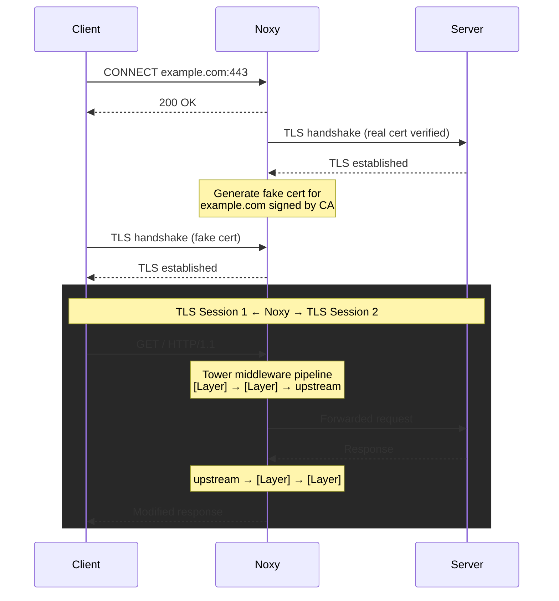
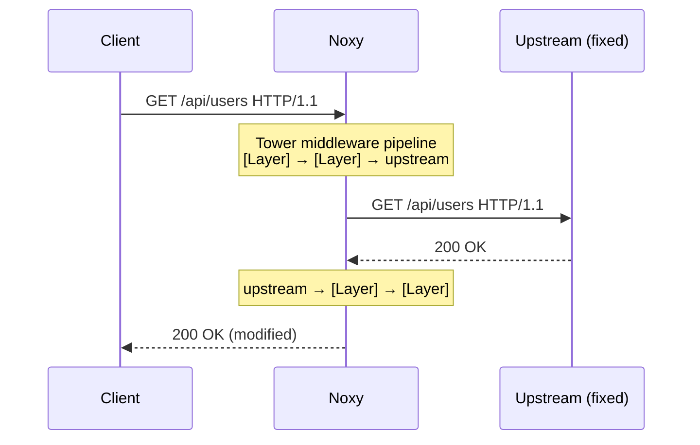
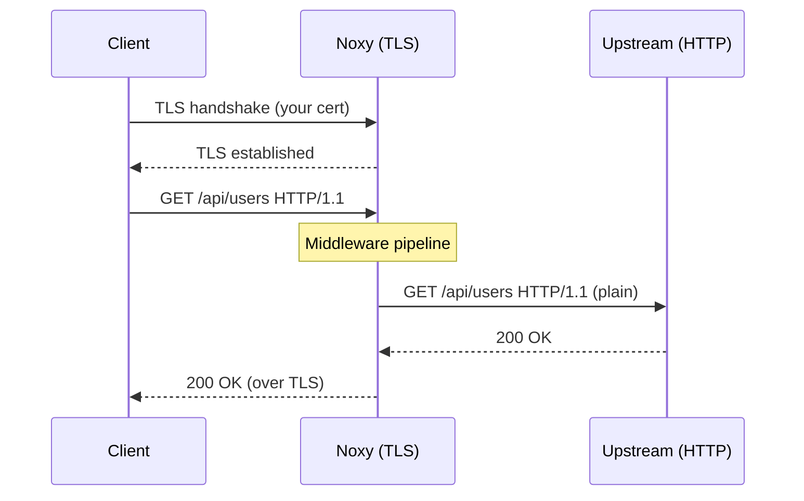

# Noxy

> *The darkness your packets pass through.*

An HTTP proxy with a pluggable middleware pipeline. Forward mode intercepts HTTPS via TLS MITM; reverse mode sits in front of a backend and forwards traffic directly. Built on top of [tower](https://crates.io/crates/tower), Noxy gives you full access to decoded HTTP requests and responses flowing through the proxy using standard tower `Service` and `Layer` abstractions -- including all existing [tower-http](https://crates.io/crates/tower-http) middleware out of the box.

## Features

- **Forward proxy** -- CONNECT tunnel with TLS MITM, per-host certificate generation signed by a user-provided CA
- **Reverse proxy** -- point Noxy at a fixed upstream and forward all incoming HTTP traffic directly -- no CONNECT, no CA, no client-side proxy configuration required
- **Multi-upstream routing** -- route requests to different backends by path prefix, host, or custom predicates. Load balance across multiple backends with round-robin or random strategies.
- **Tower middleware pipeline** -- plug in any tower `Layer` or `Service` to inspect and modify HTTP traffic. Works with tower-http layers (compression, tracing, CORS, etc.) and your own custom services. Use `from_fn` to create middleware from a simple async closure without boilerplate.
- **Built-in middleware** -- traffic logging, header modification, URL rewriting, block list, latency injection, bandwidth throttling, fault injection, rate limiting, sliding window rate limiting, retry with exponential backoff and retry budget, circuit breaker, fixed responses, and TypeScript scripting
- **Redis backend** -- optional Redis-backed state for rate limiting, sliding window, and circuit breaker middleware. Enables shared state across multiple proxy instances for horizontal scaling. Falls back to in-memory on Redis errors. (`redis` feature)
- **Conditional rules** -- apply middleware only to requests matching a host, path, or HTTP method (supports glob patterns: `*`, `**`, `?`, `[a-z]`)
- **KDL config file** -- configure the proxy and middleware rules declaratively, with nested `match` blocks for layered rules
- **Upstream connection pooling** -- reuses TLS connections to upstream servers across client tunnels. HTTP/2 connections are multiplexed; HTTP/1.1 connections are recycled from an idle pool.
- HTTP/1.1 and HTTP/2 support (auto-negotiated via ALPN)
- Streaming bodies -- middleware can process data as it arrives without buffering
- Async I/O with Tokio and Hyper

## Library Usage

### Forward proxy (TLS MITM)

```rust,ignore
use std::time::Duration;
use noxy::Proxy;
use noxy::middleware::*;

let proxy = Proxy::builder()
    .ca_pem_files("ca-cert.pem", "ca-key.pem")?
    // Log all traffic with request/response bodies
    .http_layer(TrafficLogger::new().log_bodies(true))
    // Decode gzip/brotli/deflate/zstd response bodies
    .http_layer(ContentDecoder::new())
    // Add latency to every request
    .http_layer(LatencyInjector::fixed(Duration::from_millis(200)))
    // Limit bandwidth to 50 KB/s
    .http_layer(BandwidthThrottle::new(50 * 1024))
    // Global rate limit: 100 requests per second
    .http_layer(RateLimiter::global(100, Duration::from_secs(1)))
    // Per-host sliding window: 10 req/s per hostname
    .http_layer(SlidingWindow::per_host(10, Duration::from_secs(1)))
    // Retry 429/5xx responses up to 3 times with exponential backoff
    .http_layer(Retry::default().max_retries(3))
    // Trip circuit after 5 consecutive failures, recover in 30s
    .http_layer(CircuitBreaker::global(5, Duration::from_secs(30)))
    // Inject request/response headers
    .http_layer(
        ModifyHeaders::new()
            .set_request("x-proxy", "noxy")
            .remove_response("server"),
    )
    // Rewrite request paths
    .http_layer(UrlRewrite::path("/api/v1/{*rest}", "/v2/{rest}")?)
    // Block tracking domains
    .http_layer(BlockList::new().host("*.tracking.com")?)
    // 50% of requests to /flaky return 503
    .http_layer(FaultInjector::new().error_rate(0.5).when_path("/flaky"))
    // Glob pattern: add latency to all paths under /api/*/slow
    .http_layer(LatencyInjector::fixed(Duration::from_millis(500)).when_path_glob("/api/*/slow")?)
    // Return a fixed response for /health
    .http_layer(SetResponse::ok("ok").when_path("/health"))
    .build()?;

proxy.listen("127.0.0.1:8080").await?;
```

### Reverse proxy

```rust,ignore
use noxy::Proxy;

let proxy = Proxy::builder()
    .reverse_proxy("http://localhost:3000")?
    .http_layer(my_tower_layer)
    .build()?;

proxy.listen("127.0.0.1:8080").await?;
```

### Multi-upstream routing

```rust,ignore
use noxy::Proxy;
use noxy::middleware::Upstream;

let proxy = Proxy::builder()
    .reverse_proxy("http://default:3000")?
    // Route /api to a dedicated backend
    .route_prefix("/api", "http://api:8080")?
    // Load balance /static across two CDN nodes
    .route_prefix_balanced("/static", ["http://cdn1:9000", "http://cdn2:9000"])?
    // Custom predicate with full-flexibility API
    .route(
        |req| req.headers().contains_key("x-canary"),
        Upstream::new(["http://canary:8080"])?,
    )
    .build()?;

proxy.listen("127.0.0.1:8080").await?;
```

Any tower `Layer<HttpService>` works in both modes. The innermost service forwards requests to the upstream server; your layers wrap around it in an onion model and can inspect or modify requests before forwarding and responses after.

### Custom middleware

Use `http_middleware` to create middleware from an async closure instead of implementing `Layer` + `Service` manually. The closure receives each request and a `Next` handle for forwarding it downstream:

```rust,ignore
use noxy::Proxy;

let proxy = Proxy::builder()
    .ca_pem_files("ca-cert.pem", "ca-key.pem")?
    .http_middleware(|mut req, next| async move {
        // Modify the request before forwarding
        req.headers_mut().insert("x-proxy", "noxy".parse().unwrap());

        // Forward to the next service (or upstream)
        let mut response = next.run(req).await?;

        // Modify the response before returning to the client
        response.headers_mut().insert("x-powered-by", "noxy".parse().unwrap());
        Ok(response)
    })
    .build()?;

proxy.listen("127.0.0.1:8080").await?;
```

Short-circuit without forwarding upstream by returning a response directly:

```rust,ignore
use noxy::Proxy;
use noxy::http::full_body;

let proxy = Proxy::builder()
    .reverse_proxy("http://localhost:3000")?
    .http_middleware(|req, _next| async move {
        if req.uri().path() == "/health" {
            return Ok(http::Response::new(full_body("ok")));
        }
        _next.run(req).await
    })
    .build()?;
```

For shared state across requests, capture an `Arc` in the closure:

```rust,ignore
use std::sync::{Arc, atomic::{AtomicU64, Ordering}};
use noxy::Proxy;

let counter = Arc::new(AtomicU64::new(0));
let c = counter.clone();

let proxy = Proxy::builder()
    .reverse_proxy("http://localhost:3000")?
    .http_middleware(move |req, next| {
        let c = c.clone();
        async move {
            c.fetch_add(1, Ordering::Relaxed);
            next.run(req).await
        }
    })
    .build()?;
```

The equivalent `from_fn` function works with `http_layer` for composability with `Conditional` and other layers:

```rust,ignore
use noxy::Proxy;
use noxy::middleware::from_fn;

let proxy = Proxy::builder()
    .ca_pem_files("ca-cert.pem", "ca-key.pem")?
    .http_layer(from_fn(|req, next| async move {
        next.run(req).await
    }))
    .build()?;
```

## Installation

### Pre-built binaries

Download a pre-built binary from the [latest release](https://github.com/reu/noxy/releases/latest):

| Platform      | Architecture | Download |
|---------------|--------------|----------|
| Linux         | x86_64       | [noxy-x86_64-unknown-linux-gnu.tar.gz](https://github.com/reu/noxy/releases/latest/download/noxy-x86_64-unknown-linux-gnu.tar.gz) |
| Linux         | aarch64      | [noxy-aarch64-unknown-linux-gnu.tar.gz](https://github.com/reu/noxy/releases/latest/download/noxy-aarch64-unknown-linux-gnu.tar.gz) |
| macOS         | Apple Silicon | [noxy-aarch64-apple-darwin.tar.gz](https://github.com/reu/noxy/releases/latest/download/noxy-aarch64-apple-darwin.tar.gz) |

```bash
# Example: install on Linux x86_64
curl -L https://github.com/reu/noxy/releases/latest/download/noxy-x86_64-unknown-linux-gnu.tar.gz | tar xz
sudo mv noxy /usr/local/bin/
```

### Cargo

```bash
cargo install noxy --features cli
```

## Quick Start

### Reverse proxy (simplest)

No certificates needed -- just point Noxy at a backend:

```bash
# Start noxy in front of a local service
noxy --upstream http://localhost:3000 --log

# Requests go directly to noxy, no proxy configuration needed
curl http://127.0.0.1:8080/api/users
```

### Forward proxy (TLS MITM)

#### 1. Generate a CA certificate

```bash
cargo run --features cli -- --generate
```

Or with OpenSSL:

```bash
openssl req -x509 -newkey rsa:2048 -keyout ca-key.pem -out ca-cert.pem -days 365 -nodes -subj "/CN=Noxy CA"
```

#### 2. Run the proxy

```bash
cargo run --features cli
```

#### 3. Make a request through the proxy

```bash
curl --proxy http://127.0.0.1:8080 --cacert ca-cert.pem https://example.com
```

#### Trusting the CA system-wide

Instead of passing `--cacert` every time, you can install `ca-cert.pem` into your OS or browser trust store. This lets any application use the proxy transparently.

**Important:** Only do this in development/testing environments. Remove the CA when you're done.

## CLI

The CLI provides flags for common middleware without needing a config file.

```bash
Usage: noxy [OPTIONS]

Options:
      --config <CONFIG>        Path to KDL config file
      --cert <CERT>            Path to CA certificate PEM file [default: ca-cert.pem]
      --key <KEY>              Path to CA private key PEM file [default: ca-key.pem]
  -p, --port <PORT>            Port to listen on [default: 8080]
      --bind <BIND>            Bind address [default: 127.0.0.1]
      --generate               Generate a new CA cert+key pair and exit
      --upstream <URL>         Reverse proxy mode: forward all traffic to this upstream URL
      --tls-cert <PATH>        TLS cert for client-facing HTTPS (reverse proxy mode)
      --tls-key <PATH>         TLS key for client-facing HTTPS (reverse proxy mode)
      --log                    Enable traffic logging
      --log-bodies             Log request/response bodies (implies --log)
      --latency <LATENCY>      Add global latency (e.g., "200ms", "100ms..500ms")
      --bandwidth <BANDWIDTH>  Global bandwidth limit in bytes per second
      --rate-limit <RATE>              Global rate limit (e.g., "30/1s", "1500/60s"). Repeatable.
      --per-host-rate-limit <RATE>     Per-host rate limit (e.g., "10/1s"). Repeatable.
      --sliding-window <RATE>          Sliding window rate limit (e.g., "30/1s"). Repeatable.
      --per-host-sliding-window <RATE> Per-host sliding window (e.g., "10/1s"). Repeatable.
      --retry <N>                      Retry failed requests (429, 502, 503, 504) up to N times
      --retry-max-body <BYTES>         Max request body bytes captured for retry replay (default: 1048576)
      --retry-max-backoff <DURATION>   Max backoff delay for retry exponential backoff (default: 30s)
      --retry-budget <RATIO>           Max fraction of requests that can be retries (e.g., 0.2)
      --circuit-breaker <SPEC>         Circuit breaker (e.g., "5/30s" = trip after 5 failures, recover in 30s)
      --rewrite-path <SPEC>                Rewrite request path (e.g., "/old/{*rest}=/new/{rest}"). Repeatable.
      --rewrite-path-regex <SPEC>        Rewrite request path via regex (e.g., "/api/v\d+/(.*)=/latest/$1"). Repeatable.
      --block-host <PATTERN>             Block hosts matching a glob pattern. Repeatable.
      --block-path <PATTERN>             Block paths matching a glob pattern. Repeatable.
      --set-request-header <HEADER>     Set a request header (e.g., "x-proxy: noxy"). Repeatable.
      --remove-request-header <NAME>   Remove a request header. Repeatable.
      --set-response-header <HEADER>   Set a response header (e.g., "x-served-by: noxy"). Repeatable.
      --remove-response-header <NAME>  Remove a response header. Repeatable.
      --script <PATH>                  Path to a JS/TS middleware script (requires scripting feature)
      --script-max-body <BYTES>        Max bytes scripts may buffer for req/res body reads
      --redis-url <URL>                Redis URL for distributed middleware state (requires redis feature)
      --pool-max-idle <N>              Max idle connections per host (default: 8, 0 to disable)
      --pool-idle-timeout <DURATION>   Idle timeout for pooled connections (e.g., "90s")
      --accept-invalid-certs           Accept invalid upstream TLS certificates
  -h, --help                   Print help

# Log all traffic
noxy --log

# Log traffic including request/response bodies
noxy --log-bodies

# Add 200ms latency to every request
noxy --latency 200ms

# Add random latency between 100ms and 500ms
noxy --latency 100ms..500ms

# Limit bandwidth to 10 KB/s
noxy --bandwidth 10240

# Rate limit: 30 requests per second
noxy --rate-limit 30/1s

# Per-host rate limit: 10 requests per second per hostname
noxy --per-host-rate-limit 10/1s

# Multi-window rate limiting
noxy --rate-limit 30/1s --rate-limit 1500/60s

# Sliding window: hard-cap 30 requests per second
noxy --sliding-window 30/1s

# Per-host sliding window: 10 requests per second per hostname
noxy --per-host-sliding-window 10/1s

# Retry failed requests up to 3 times with exponential backoff
noxy --retry 3

# Circuit breaker: trip after 5 consecutive 5xx failures, recover after 30s
noxy --circuit-breaker 5/30s

# Rewrite request paths using matchit patterns
noxy --upstream http://localhost:3000 --rewrite-path "/api/v1/{*rest}=/v2/{rest}"

# Rewrite request paths using regex
noxy --upstream http://localhost:3000 --rewrite-path-regex "/api/v\d+/(.*)=/latest/$1"

# Block requests to tracking domains
noxy --block-host "*.tracking.com" --block-host "ads.example.com"

# Block requests to admin paths
noxy --block-path "/admin/*" --block-path "/debug/**"

# Add a request header to all proxied requests
noxy --set-request-header "x-proxy: noxy"

# Remove the Server response header
noxy --remove-response-header server

# Combine multiple flags
noxy --log --latency 200ms --bandwidth 10240

# Set upstream connection pool size per host (0 to disable)
noxy --pool-max-idle 16

# Set pool idle timeout
noxy --pool-idle-timeout 120s

# Accept invalid upstream certificates (e.g. self-signed)
noxy --accept-invalid-certs

# Custom port, bind address, and CA paths
noxy --port 9090 --bind 127.0.0.1 --cert my-ca.pem --key my-ca-key.pem

# Reverse proxy to a local backend
noxy --upstream http://localhost:3000 --log

# Reverse proxy to an HTTPS backend with rate limiting
noxy --upstream https://api.example.com --rate-limit 100/1s

# Reverse proxy with client-facing TLS
noxy --upstream http://localhost:3000 --tls-cert server.pem --tls-key server-key.pem

# Run a TypeScript middleware script (requires scripting feature)
noxy --upstream http://localhost:3000 --script middleware.ts

# Limit body bytes scripts may buffer when calling req.body()/res.body()
noxy --upstream http://localhost:3000 --script middleware.ts --script-max-body 262144

# Use Redis for distributed rate limiting across multiple proxy instances (requires redis feature)
noxy --upstream http://localhost:3000 --redis-url redis://localhost:6379 --rate-limit 100/1s
```

## Config File

For conditional rules and more complex setups, use a [KDL](https://kdl.dev) config file.

```bash
noxy --config proxy.kdl
```

CLI flags override config file settings for global options (port, bind address, CA paths, etc.) and append additional unconditional rules.

A config has top-level globals (`port`, `bind`, `ca`, …), an optional list of `credential` entries, and a body of rule nodes. Rule nodes are either middleware leaves (`log`, `latency`, `rate-limit`, …) or `match` blocks (with aliases `host`, `path`, `method`, `methods`) that scope nested rules to requests satisfying their predicate. Nested matches AND naturally — `host "x" { path "/y" { … } }` is the same as `match host="x" path="/y" { … }`.

### Reverse proxy config

```kdl
port 8080
reverse-proxy "http://localhost:3000"

// Optional: serve HTTPS to clients
// tls cert="server.pem" key="server-key.pem"

// Optional: use Redis for distributed middleware state (requires redis feature)
// redis url="redis://localhost:6379"

log
rate-limit count=100 window="1s"
```

### Multi-upstream routing config

```kdl
port 8080
reverse-proxy "http://default:3000"

// Route /api to a dedicated backend with rate limiting
path "/api/" {
    upstream "http://api:8080"
    rate-limit count=100 window="1s"
}

// Load balance /static across two CDN nodes
path "/static/" {
    upstream "http://cdn1:9000" "http://cdn2:9000" balance="round-robin"
}

// Random selection for /images
path "/images/" {
    upstream "http://img1:9000" "http://img2:9000" balance="random"
}
```

### Forward proxy config

```kdl
port 8080
ca cert="ca-cert.pem" key="ca-key.pem"

// accept-invalid-upstream-certs true
// pool-max-idle-per-host 8
// pool-idle-timeout "90s"

// Log all traffic
log

// Log with request/response bodies
// log bodies=true

// Add 200ms latency to API requests
path "/api/" {
    latency "200ms"
}

// Simulate slow downloads with random latency and bandwidth limit
path "/downloads/" {
    latency "50ms..200ms"
    bandwidth 10240
}

// Inject faults on a specific endpoint
path "/flaky" {
    fault error-rate=0.5 abort-rate=0.02
}

// Mock a health check endpoint
path "/health" {
    respond body="ok"
}

// Rate limit: 30 requests per second globally
rate-limit count=30 window="1s"

// Rate limit: 1500 requests per minute, per host, with burst of 100
rate-limit count=1500 window="60s" burst=100 per-host=true

// Sliding window: hard-cap 10 requests per second (no burst, no smoothing)
sliding-window count=10 window="1s"

// Sliding window: per-host, 500 requests per minute
sliding-window count=500 window="60s" per-host=true

// Retry failed requests (429, 502, 503, 504) up to 3 times
retry max-retries=3 backoff="1s" max-replay-body-bytes=1048576

// Retry only 503s with custom statuses, scoped to /api
path "/api/" {
    retry max-retries=5 backoff="500ms" {
        statuses 503
    }
}

// Retry with budget: at most 20% of requests can be retries (prevents retry storms)
retry max-retries=3 {
    budget ratio=0.2 window="10s" min-retries=30
}

// Circuit breaker: trip after 5 consecutive 5xx failures, recover after 30s
circuit-breaker threshold=5 recovery="30s"

// Per-host circuit breaker with 2 half-open probes
circuit-breaker threshold=3 recovery="10s" half-open-probes=2 per-host=true

// Circuit breaker with local cache to reduce Redis round-trips (Redis only)
circuit-breaker threshold=5 recovery="30s" cache-ttl="100ms"

// Add a request header and strip a response header
set-request-header "x-proxy" "noxy"
remove-response-header "server"

// Add API version header to /api requests
path "/api/" {
    set-request-header "x-api-version" "2"
}

// Rewrite request paths using matchit patterns
rewrite-path "/api/v1/{*rest}" "/v2/{rest}"

// Rewrite request paths using regex
rewrite-path-regex "/api/v\\d+/(.*)" "/latest/$1"

// Block requests to tracking domains and admin paths
block {
    host "*.tracking.com"
    host "ads.example.com"
    path "/admin/*"
}

// Block with custom status and body
block {
    host "internal.corp.com"
    response status=404 body="not found"
}

// Run a TypeScript middleware script (requires scripting feature)
// script "middleware.ts"

// Run a script with a shared V8 isolate across all connections, scoped to /api
// path "/api/" {
//     script "api_middleware.ts" shared=true
// }

// Return 503 for all paths under /fail
path "/fail/" {
    respond status=503 body="service unavailable"
}

// Glob patterns in match conditions
// Match any subdomain of example.com
host "*.example.com" {
    latency "100ms"
}

// Match any single-segment path under /api/
path "/api/*/users" {
    rate-limit count=10 window="1s"
}

// Match all paths recursively under /static/
path "/static/**" {
    set-response-header "cache-control" "public, max-age=86400"
}

// Match by HTTP method, scoped to /api
methods "POST" "PUT" "DELETE" {
    path "/api/" {
        rate-limit count=10 window="1s"
    }
}
```

### Rule nodes

The body of a config is a sequence of rule nodes. Match nodes scope their nested children to requests satisfying a predicate; middleware nodes apply directly. Match nodes nest, AND-ing predicates as you go deeper.

#### Match nodes

| Node          | Form                                              | Notes |
|---------------|---------------------------------------------------|-------|
| `match`       | `match host="..." path="..." method="..." { ... }` | Multi-field predicate. All fields AND together. |
| `host`        | `host "*.example.com" { ... }`                    | Single-host alias. Glob supported. |
| `path`        | `path "/api/" { ... }`                            | Single-path alias. Glob supported; trailing `/` means subtree-including-self. |
| `method`      | `method "GET" { ... }`                            | Single-method alias. |
| `methods`     | `methods "GET" "POST" { ... }`                    | Multi-method alias (variadic). |

Match properties: `host`, `path`, `method`, and `header { ... }` (child node, name + value). Each match node also accepts an optional `name="..."` for stable Redis key scoping.

Path globs use `*` (single segment), `**` (any depth), `?` (single char), `[a-z]` (character class). Trailing `/` on a path turns it into a "subtree-including-self" match: `path "/v1/"` matches `/v1`, `/v1/foo`, `/v1/foo/bar`.

#### Middleware nodes

| Node                         | Form                                                                    | Notes |
|------------------------------|-------------------------------------------------------------------------|-------|
| `log`                        | `log` or `log bodies=true`                                              | Traffic logger. |
| `latency`                    | `latency "200ms"` or `latency "100ms..500ms"`                           | Fixed or random range. |
| `bandwidth`                  | `bandwidth 10240`                                                       | Bytes/sec throughput limit. |
| `fault`                      | `fault error-rate=0.5 abort-rate=0.02 error-status=503`                | Random faults. |
| `rate-limit`                 | `rate-limit count=30 window="1s" burst=100 per-host=true`              | Token bucket. |
| `sliding-window`             | `sliding-window count=10 window="1s" per-host=true`                    | Hard-cap, no burst. |
| `retry`                      | `retry max-retries=3 backoff="1s" max-backoff="30s" max-replay-body-bytes=1048576 { statuses 503 429; budget ratio=0.2 window="10s" min-retries=30 }` | Retry on 429/5xx by default. `statuses` and `budget` are child nodes. |
| `circuit-breaker`            | `circuit-breaker threshold=5 recovery="30s" half-open-probes=2 per-host=true cache-ttl="100ms"` | `cache-ttl` is Redis-only. |
| `respond`                    | `respond body="ok" status=200`                                          | Short-circuits without forwarding upstream. |
| `upstream`                   | `upstream "http://a:80" "http://b:80" balance="round-robin"`           | Variadic URLs; `balance="round-robin"` (default) or `"random"`. Routes matched requests to the given backend(s). |
| `block`                      | `block { host "*.tracking.com"; path "/admin/*"; response status=404 body="not found" }` | `host` / `path` children stack; `response` child is optional (default 403). |
| `set-request-header`         | `set-request-header "x-proxy" "noxy"`                                  | Sets one request header. |
| `append-request-header`      | `append-request-header "via" "noxy"`                                   | Appends one request header. |
| `remove-request-header`      | `remove-request-header "x-internal"`                                   | Removes one request header. |
| `set-response-header`        | `set-response-header "x-served-by" "noxy"`                             | Sets one response header. |
| `append-response-header`     | `append-response-header "via" "noxy"`                                  | Appends one response header. |
| `remove-response-header`     | `remove-response-header "server"`                                      | Removes one response header. |
| `rewrite-path`               | `rewrite-path "/api/v1/{*rest}" "/v2/{rest}"`                          | matchit-pattern rewrite. |
| `rewrite-path-regex`         | `rewrite-path-regex "/v\\d+/(.*)" "/latest/$1"`                        | Regex rewrite. |
| `script`                     | `script "middleware.ts" shared=true max-body-bytes=1048576`            | Requires `scripting` feature. |

## Scripting Middleware

Write request/response manipulation logic in TypeScript or JavaScript. Scripts run in an embedded V8 engine via [deno_core](https://crates.io/crates/deno_core). Requires the `scripting` feature.

```rust,ignore
use noxy::Proxy;
use noxy::middleware::ScriptLayer;

let proxy = Proxy::builder()
    .ca_pem_files("ca-cert.pem", "ca-key.pem")?
    .http_layer(ScriptLayer::from_file("middleware.ts")?)
    .build();
```

The script exports a default async function that receives the request and a `respond` function to forward it upstream:

```typescript
// middleware.ts
export default async function(req: Request, respond: Function) {
  // Add a header before forwarding
  req.headers.set("x-proxy", "noxy");

  // Forward to upstream
  const res = await respond(req);

  // Modify the response
  res.headers.set("x-intercepted", "true");

  return res;
}
```

Short-circuit responses without forwarding upstream:

```typescript
export default async function(req: Request, respond: Function) {
  if (req.url === "/health") {
    return new Response("ok", { status: 200 });
  }
  return await respond(req);
}
```

Read request or response bodies (lazy -- only buffered if you call `body()`):

```typescript
export default async function(req: Request, respond: Function) {
  const body = await req.body(); // Uint8Array
  console.log("Request size:", body.length);

  const res = await respond(req);
  const resBody = await res.body(); // Uint8Array

  return new Response(resBody, {
    status: res.status,
    headers: res.headers,
  });
}
```

By default, each connection gets its own V8 isolate, so global state in the script (like variables declared outside the handler) is scoped per connection. Use `.shared()` to reuse a single isolate across all connections:

```rust,ignore
// Per-connection (default) -- each connection gets a fresh isolate
ScriptLayer::from_file("middleware.ts")?

// Shared -- one isolate for all connections, global state is shared
ScriptLayer::from_file("middleware.ts")?.shared()
```

Limit script body buffering (applies to both `req.body()` and `res.body()`):

```rust,ignore
ScriptLayer::from_file("middleware.ts")?
    .max_body_bytes(256 * 1024)
```

## Redis Backend

Stateful middleware (rate limiting, sliding window, circuit breaker) keeps state in-memory by default. For horizontal scaling across multiple proxy instances, enable the `redis` feature to share state via Redis.

```bash
cargo install noxy --features cli,redis
```

### KDL config

```kdl
redis url="redis://localhost:6379"
// redis url="redis://localhost:6379" prefix="noxy:"

rate-limit count=100 window="1s"
circuit-breaker threshold=5 recovery="30s"
```

When `redis` is configured, all `rate-limit`, `sliding-window`, and `circuit-breaker` rules automatically use Redis. If Redis becomes unreachable, each store transparently falls back to an in-memory store and logs a warning.

### CLI

```bash
noxy --upstream http://localhost:3000 --redis-url redis://localhost:6379 --rate-limit 100/1s
```

### Library API

```rust,ignore
use std::time::Duration;
use noxy::Proxy;
use noxy::middleware::{RedisConnection, RedisRateLimitStore, RateLimiter};

let conn = RedisConnection::open("redis://localhost:6379")?;
let store = RedisRateLimitStore::new(conn, 100.0, 100.0);  // rate=100/s, burst=100
let limiter = RateLimiter::with_store(store, |_| String::new());  // global key

let proxy = Proxy::builder()
    .reverse_proxy("http://localhost:3000")?
    .http_layer(limiter)
    .build()?;
```

All three stores follow the same pattern: `RedisRateLimitStore`, `RedisSlidingWindowStore`, and `RedisCircuitBreakerStore` each take a `RedisConnection` and embed an in-memory fallback internally.

## How It Works

Noxy operates in two modes. Both feed traffic through the same tower middleware pipeline -- the difference is how connections are established.

### Forward proxy (TLS MITM)

Normal HTTPS creates an encrypted tunnel between client and server -- nobody in the middle can read the traffic. Noxy breaks that tunnel into **two separate TLS sessions** and sits in between, with your middleware pipeline processing decoded HTTP traffic.


```mermaid
sequenceDiagram
    participant C as Client
    participant N as Noxy
    participant S as Server

    C->>N: CONNECT example.com:443
    N-->>C: 200 OK

    N->>S: TLS handshake (real cert verified)
    S-->>N: TLS established

    Note over N: Generate fake cert for<br/>example.com signed by CA

    C->>N: TLS handshake (fake cert)
    N-->>C: TLS established

    rect rgb(40, 40, 40)
        Note over C,S: TLS Session 1 ← Noxy → TLS Session 2

        C->>N: GET / HTTP/1.1
        Note over N: Tower middleware pipeline<br/>[Layer] → [Layer] → upstream
        N->>S: Forwarded request

        S-->>N: Response
        Note over N: upstream → [Layer] → [Layer]
        N-->>C: Modified response
    end
```

1. **HTTP CONNECT** -- the client sends an unencrypted `CONNECT example.com:443` request to the proxy. The proxy learns the target hostname from this plaintext request.

2. **Upstream TLS** -- Noxy opens a real TLS connection to `example.com`, verifying the server's authentic certificate against Mozilla's root CAs.

3. **Fake certificate generation** -- Noxy generates a TLS certificate for `example.com` signed by the user-provided CA, created on the fly per host.

4. **Client TLS** -- Noxy performs a TLS handshake with the client using the fake certificate. The client accepts it because it trusts the CA.

5. **HTTP relay with middleware** -- with both TLS sessions established, Hyper handles the HTTP connection on both sides. Each request from the client passes through your tower middleware pipeline before being forwarded upstream, and each response passes back through the pipeline before being sent to the client.

### Reverse proxy

In reverse proxy mode, Noxy sits in front of a **fixed upstream** and forwards all incoming HTTP traffic directly. There is no CONNECT tunnel, no CA certificate, and no client-side proxy configuration -- clients talk to Noxy as if it were the real server.


```mermaid
sequenceDiagram
    participant C as Client
    participant N as Noxy
    participant S as Upstream (fixed)

    C->>N: GET /api/users HTTP/1.1
    Note over N: Tower middleware pipeline<br/>[Layer] → [Layer] → upstream
    N->>S: GET /api/users HTTP/1.1

    S-->>N: 200 OK
    Note over N: upstream → [Layer] → [Layer]
    N-->>C: 200 OK (modified)
```

1. **Direct HTTP** -- the client sends a plain HTTP request to Noxy's address. No CONNECT, no proxy configuration, no certificate trust needed.

2. **Middleware pipeline** -- the request passes through the tower middleware stack (rate limiting, logging, header injection, etc.), exactly the same pipeline used in forward mode.

3. **Upstream forwarding** -- Noxy forwards the request to the configured upstream. The upstream can be HTTP or HTTPS -- Noxy handles TLS to the backend transparently.

4. **Response relay** -- the upstream response passes back through the middleware stack and is returned to the client.

Optionally, Noxy can **serve HTTPS to clients** using a TLS certificate you provide (`--tls-cert` / `--tls-key`). This is independent of the upstream scheme -- you can terminate TLS at Noxy while forwarding to a plain HTTP backend, or chain TLS end-to-end.


```mermaid
sequenceDiagram
    participant C as Client
    participant N as Noxy (TLS)
    participant S as Upstream (HTTP)

    C->>N: TLS handshake (your cert)
    N-->>C: TLS established

    C->>N: GET /api/users HTTP/1.1
    Note over N: Middleware pipeline
    N->>S: GET /api/users HTTP/1.1 (plain)

    S-->>N: 200 OK
    N-->>C: 200 OK (over TLS)
```

### Use cases

**Sidecar proxy** -- put Noxy in front of a microservice to add rate limiting, circuit breaking, retry, and logging without modifying the service itself:

```bash
noxy --upstream http://localhost:3000 \
     --rate-limit 100/1s \
     --circuit-breaker 5/30s \
     --retry 3 \
     --log
```

**API gateway** -- terminate TLS, route to multiple backends, and apply middleware:

```bash
noxy --upstream http://localhost:8080 \
     --tls-cert server.pem --tls-key server-key.pem \
     --set-request-header "x-forwarded-proto: https" \
     --remove-response-header server \
     --rate-limit 1000/60s
```

```kdl
// Multi-backend gateway via config file
port 443
bind "127.0.0.1"
reverse-proxy "http://web:3000"

tls cert="server.pem" key="server-key.pem"

path "/api/" {
    upstream "http://api:8080"
    rate-limit count=1000 window="60s"
}

path "/static/" {
    upstream "http://cdn1:9000" "http://cdn2:9000" balance="round-robin"
}
```

**Testing and development** -- inject faults, latency, or fixed responses in front of a real API to test client resilience:

```bash
# Simulate a flaky upstream
noxy --upstream https://api.example.com \
     --latency 200ms..800ms \
     --log-bodies
```

```kdl
// Surgical fault injection via config file
port 8080
reverse-proxy "https://api.example.com"

log bodies=true

path "/api/checkout" {
    fault error-rate=0.3 error-status=503
}

path "/api/search/" {
    latency "500ms..2s"
}

path "/api/health" {
    respond body="{\"status\": \"ok\"}"
}
```

## License

MIT
